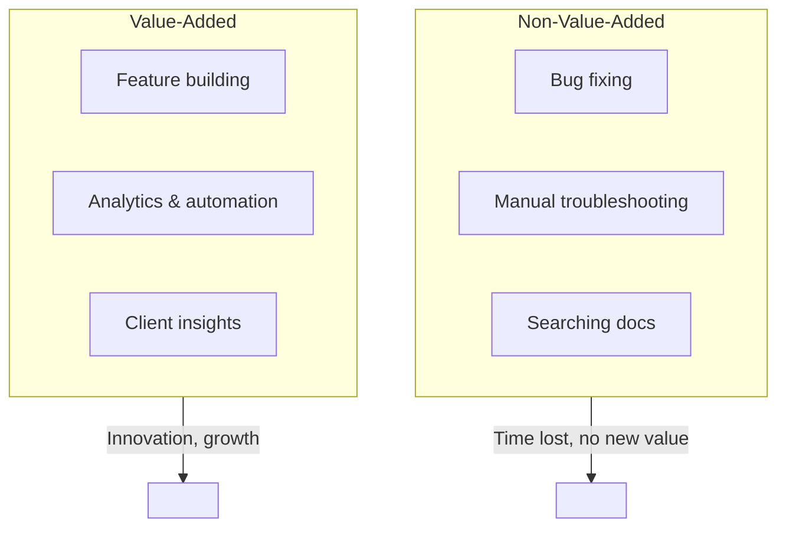

# AI-Powered Slack Bot: Demo & Business Value

---

## Why We Built This

>   
Fixing bugs and troubleshooting issues is a necessary part of software and data engineering—but it’s not value-added work. It doesn’t create new features, improve our product, or drive revenue. For Polaris and Wpromote, our real value comes from innovation, analytics, and delivering new solutions to clients.

**Non-value-added work:**
-  Fixing bugs
-  Searching for solutions in documentation
-  Repeating manual troubleshooting steps
-  Answering the same support questions over and over

**Value-added work:**
-  Building new features for Polaris
-  Improving analytics and reporting
-  Creating new automations
-  Delivering insights to clients

---

## The Solution: Let AI Handle the Bugs


We built a proof-of-concept Slack bot that uses AI to help our team fix bugs faster. Instead of spending time searching for solutions, the bot:
-  Reads your question in Slack
-  Searches our knowledge base for relevant answers
-  Uses OpenAI to summarize and suggest a fix
-  Replies instantly in Slack with steps and code

---

## Demo Example: Value-Added vs. Non-Value-Added

<!-- Mermaid Comparison Diagram -->



|                | Non-Value-Added Work         | Value-Added Work           |
|----------------|-----------------------------|----------------------------|
| **Goal**       | Fixing bugs, troubleshooting | Building new features      |
| **Process**    | Manual search, repeat steps | Automated, AI-powered help |
| **Time Spent** | 30+ min per issue           | <5 min per issue           |
| **Impact**     | No new product value        | Innovation, client value   |

```
+--------------------------+        +--------------------------+
|  Non-Value-Added         |        |   Value-Added            |
|--------------------------|        |--------------------------|
|  Bug fixing              |        |  Feature building        |
|  Manual troubleshooting  |        |  Analytics & automation  |
|  Searching docs          |        |  Client insights         |
+--------------------------+        +--------------------------+
         |                                 |
         v                                 v
   Time lost, no new value         Innovation, growth
```

**Scenario:**
- A data engineer notices Google Ads spend data is missing for a client in the dashboard.

**Old Way (Non-Value-Added):**
1.  Manually search documentation and KB articles
2.  Run spot-check SQL queries
3.  Check Airflow logs, Cloud Run logs, credentials
4.  Ask teammates for help
5.  Spend 30+ minutes fixing a routine issue

**New Way (Value-Added):**
1.  Type `/kb Why is client XYZ’s spend missing for October 10-12?` in Slack
2.  Bot instantly replies with:
   -  Summary of the issue
   -  Recommended troubleshooting steps
   -  Example SQL query
   -  Links to relevant documentation
3.  Engineer fixes the issue in minutes and gets back to building new features

---

## How It Works (Simple)


-  You ask a question in Slack
-  Bot finds the answer using AI and our KB
-  You get a clear, actionable response—no more searching

---

## Business Impact
-  **Faster bug fixes**: Less downtime, happier clients
-  **More innovation**: Engineers focus on building, not fixing
-  **Scalable support**: AI answers routine questions 24/7
-  **Better onboarding**: New hires get instant help

---

## Try It Yourself
-  Go to Slack, type `/kb [your question]`
-  See how quickly you get an answer!
- [Visit the Slack workspace here](https://test-auto-slack-kb.slack.com/)

---

## The Future


Let’s automate the routine, so our team can focus on what matters: creating value for Polaris and our clients.

---

## Questions?
Contact the Data Engineering team or see the README for technical details.

---

*Note: Diagrams are stored in the repo's assets folder. Icons provided by [Icons8](https://icons8.com/).*
